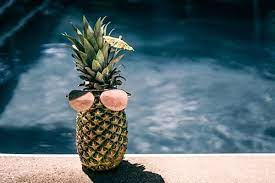

# Cours 1
## Insérer une image
Insérer une image ici: 
Image

Décrire l'image. La description doit comprendre un mot en gras et un autre en italique. 

C'est un __ananas__ qui profite de *l'été.*

## Liens vers des nouvelles de l'industrie
Trouver 5 sites qui diffusent des nouvelles sur l'industrie.

### Lien 1 
Exemple: [Animation World Network](https://www.awn.com/)

### Lien 2 
[Toonboom](https://store.toonboom.com/students)

### Lien 3 
[Stash](https://www.stashmedia.tv/)

### Lien 4 
[Parkour3](https://www.parkour3.com/fr/)

### Lien 5 
[traccossolutions](https://www.traccossolutions.ca/)
